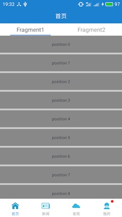
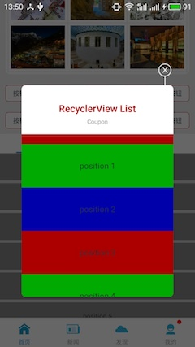
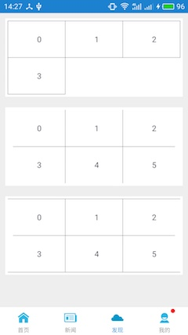
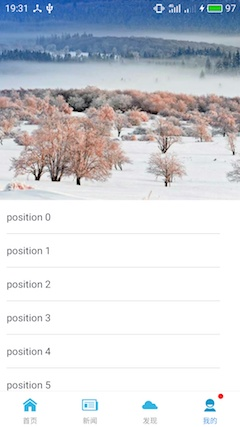

这是一个带有顶部下拉刷新，横向滚动，往上滑动  ViewPager 让 TabLayout 悬停的示例，已经处理好了手势滑动冲突和 fling 平滑地滑动。

TabLayout 悬停是用 CoordinatorLayout & AppBarLayout & CollapsingToolbarLayout 组合实现的，如果你使用过 AppBarLayout，你应当知道 AppBarLayout 配合 RecyclerVIew 时，fling 滑动的效果是不顺畅的，参见以下帖子了解这个问题：

[https://stackoverflow.com/questions/30923889/flinging-with-recyclerview-appbarlayout](https://stackoverflow.com/questions/30923889/flinging-with-recyclerview-appbarlayout)
[https://code.google.com/p/android/issues/detail?id=177729...](https://code.google.com/p/android/issues/detail?id=177729&q=appbarlayout&colspec=ID%20Type%20Status%20Owner%20Summary%20Stars)

本示例也参考了所有能找到的解决方法，最后通过自定义的 AppBarLayout.Behavior 解决：

[https://github.com/wordplat/TabNavigation/blob/master/app/src/main/java/com/wordplat/quickstart/widget/custom/AppBarHeaderBehavior.java](https://github.com/wordplat/TabNavigation/blob/master/app/src/main/java/com/wordplat/quickstart/widget/custom/AppBarHeaderBehavior.java)

本示例同时也可以拿来快速开始一个项目，里面除了包含上述的功能之外，还集成了加载更多、RecyclerView 的分割线（这也是自己画的）、带小圆点的 RadioButton。此外还处理了产品开发中常见的需求：首页 4 个RadioButton 按第二下刷新当前 fragment、不同 fragment 设置不同的状态栏样式、广告轮播图、带圆角的对话框。这些都是目前真正在做的项目里面用的，踩过数个大坑总结而来，稳定可靠，通通合成一个 Quick start，节省后续项目开发时间。

## Screenshot

        

        

## Demo download

[app-debug](https://github.com/wordplat/TabNavigation/releases/download/v1.0.0/app-debug.apk)
